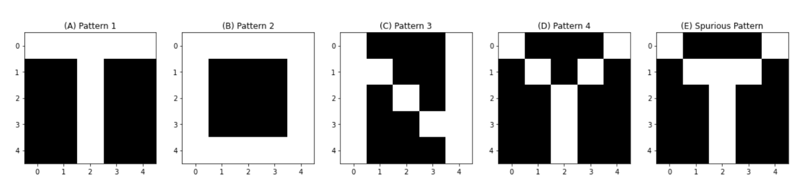

# HopfieldNet
Memory Capacity of Hopfield Networks

## Introduction
Hopfield network is an important model for association memory (a.k.a. content-addressable memory), a system that is able to retrieve memorized patterns with partial cues (Hopfield, 1982). However, a Hopfield network has a limited memory capacity (*αc*), beyond which the network performance degrades and its dynamics can be easily trapped in metastable energy states called spurious attractors/patterns (Hopfield, 1982; Amit et al., 1985). This capacity was suggested to be scaled linearly with the size of the network *N* with a factor of ~0.15 (Hopfield, 1982), 0.138 (Amit et al. 1985), or 0.144 (Crisanti et al., 1986). Others had suggested this *αc* is proportional not to *N* but rather to *N/2 ln(N)* (private communications quoted by Amit et al., 1985). In this term paper, I used the probability of a neuron to escape from a memorized pattern as an approximation for the original pattern's local stability. My calculations showed that, for an error rate of 0.5%, the capacity *αc ~ 0.15* regardless of the network size *N*. The computer simulation resulted in similar results, but the error rates were found to increase with the network size *N*.

## Problem Description
The ability of a neural network to possess long-term memory is endowed by the synaptic strength between the neurons, rather than by the activation states of the neurons (Gerstner et al., 2014). The connections between those neurons allow the memorized patterns to be the fixed points (a.k.a. attractors) of the network dynamics (Amit et al., 1985). 

The Hopfield network is an important model for associative memory or content-addressable memory. Unlike perceptron, which is purely feedforward, the Hopfield network is highly recursive such that every neuron has the opportunity to be each other’s input and output (Hopfield, 1982; Hopfield and Tank, 1985; Folli et al., 2017). The Hopfield network’s ability to store and retrieve information comes from its unique training and update rules. The “training” of a Hopfield network coincides with Hebbian learning because it creates an auto-correlation matrix in which only the connections between the activated neurons are strengthened. 

However, a Hopfield network's memory capacity is limited. The factor that limits this capacity is inherent to Hebbian learning as too many training patterns quickly complicate the energy landscape of the neuronal state space (Folli et al., 2017). Thus, an extensive Hopfield network can easily create so-called spurious attractors, which are erroneous fixed points that arise from training (Hopfield, 1982; Amit et al., 1985). The activation pattern can become trapped in one of those spurious attractors and fails to converge to the intended pattern. An example of a spurious pattern can be seen in **Figure 1**. The letters "T","O","N", and "Y" were encoded in the network's connection matrix. A spurious pattern arose in this matrix, and it was a mixture of the letters "T" and "Y" likely because of how similar the two patterns were. The network had a size of *N = 5 x 5 = 25*, and it memorized *M = 4* patterns. The pattern-to-neuron ratio is *α = M / N = 4 / 25 ~ 0.16*. 

**Figure 1**. Example of a Spurious Pattern. (A)-(D) Letters "T","O","N", and "Y" were encoded in the network's connection matrix. (E) A spurious pattern that was a mixture of the letter "T" and "Y". See the attached notebook for code. 

Hopfield (1982) suggested that the memory capacity *αc ~ 0.15*. Other researchers used more advanced techniques and showed the *αc* is smaller. Amit et al. (1985) suggested *αc = 0.138*, and Crisanti et al. (1986) revised the calculations and got *αc = 0.144*. However, the true relationship between the network size $N$ and the number of memorized pattern $M$ remains debatable today (Folli et al., 2017). The calculations of the aforementioned authors were also too obscure to be understood by an average undergraduate student. In this term paper, I estimate the memory capacity *αc* and investigate its relationship with the network size *N*. 
